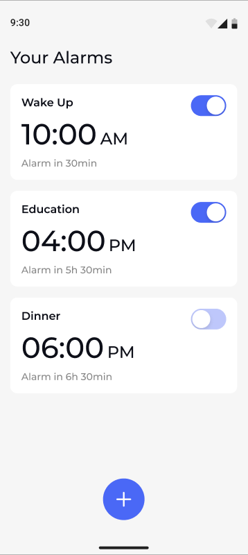
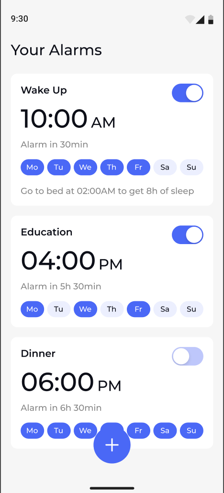

# Snoozeloo Requirements

This requirements document is used to explain the main functionality behind
Snoozeloo.

The exact looks and colors of a specific UI element can be seen on the
mockups. The app has a single theme but no light or dark theme.

Note that this serves to give you an overall impression of what the app
should be able to do. Feel free to decide how you implement specific things
(e.g., how you display a specific loading progress or how you specify error
messages).

You can find the mockups for Snoozeloo here: https://www.figma.com/design/t0TlMqJem7LCjALeyQNip2/Snoozeloo?node-id=62-6482&t=Goatlz8jjY3dyocJ-

## App Variants

The mockups include two app variants: MVP and an extended version. The
extended version-specific requirements are written in orange. Depending on
your available time, you can build either variant.

## Icons

All icons for the app can be Material design icons or taken from the mockups
as SVG (in case an equivalent Material icon doesnʼt exist)

## Alarm List Screen

- List of all created alarms^
- Empty state when there are no alarms to show^
- FAB to create a new alarm^
- The toggle on each card element to turn the alarm on or off^
- The title of the alarm is optional^
- Each card element also shows:^

```
Extended version requirements
 - Next occurrence the alarm will trigger in the format “1d 4h 45min”^
 - The weekdays the alarm will repeat on^
 - Text that says what time to go to bed for 8 hours of sleep before the alarm: “Go to bed at XX:YYpm to get 8h of sleep”. Should only be shown when:
 - The alarm is between 4 am and 10 am^
 - The current time is more than 8 hours before the set alarm time^
```

 

```
Alarms - MVP Alarms - Extended
```

## Alarm Detail Screen

All alarm configurations made on this screen should ONLY apply to this
specific alarm and should not affect the other alarms.

- Two input fields where only digits are accepted as input^
  - Validate the input only to allow a valid time between 00:00 and 23:^
- The “Save” button is only enabled when the alarm time is valid^
  - When the alarm is set to a time earlier than now, the alarm should be
    scheduled for the next day.
  - For example, It is now Monday 11:00, and the user inputs a time of

### 09:00; the alarm will then go off on Tuesday at 09:

- The text below the inputs displays when the next occurrence of the alarm

```
will trigger in the format “1d 4h 45min”
```

- Input to set the name of the alarm (optional)^
  - Show dialog to input name^
  - Only save the name when the dialog’s “Save” button is tapped and not
    when the dialog is dismissed.
- Selectable chips with the weekdays the alarm should repeat on^
- Alarm ringtone card^
  - On tap, navigate to the Ringtone Setting screen^
  - On return, update the ringtone to match the selection made on the
    Ringtone Setting screen
- Card to set the volume of the alarm when it triggers^
  - Defaults to 50%^
- Card to toggle if the alarm should vibrate or not^

## Create Alarm - MVP Create Alarm - Extended

```
Set Alarm Name Dialog - MVP
```

## Alarm Trigger Screen

- Shown when an alarm is triggered^
- Dismiss the screen and stop playing the ringtone when the “Turn Off”

```
button is tapped.
```

- “Snooze” button that stops the alarm and dismisses the screen^
  - It should also schedule a new alarm for 5 minutes in the future with the
    same configurations as the one that got snoozed
  - Snoozing an alarm should not update the alarm’s regular repeating
    schedule

```
Triggered Alarm - MVP Triggered Alarm - Extended
```

## Ringtone Setting Screen

- Display a list of all default Android ringtones^
- Include a silent option^
- On tap, mark the item selected and play a short preview of the ringtone^
  - DO NOT navigate back when the user selects a new option

```
Ringtone Settings - Extended
```
